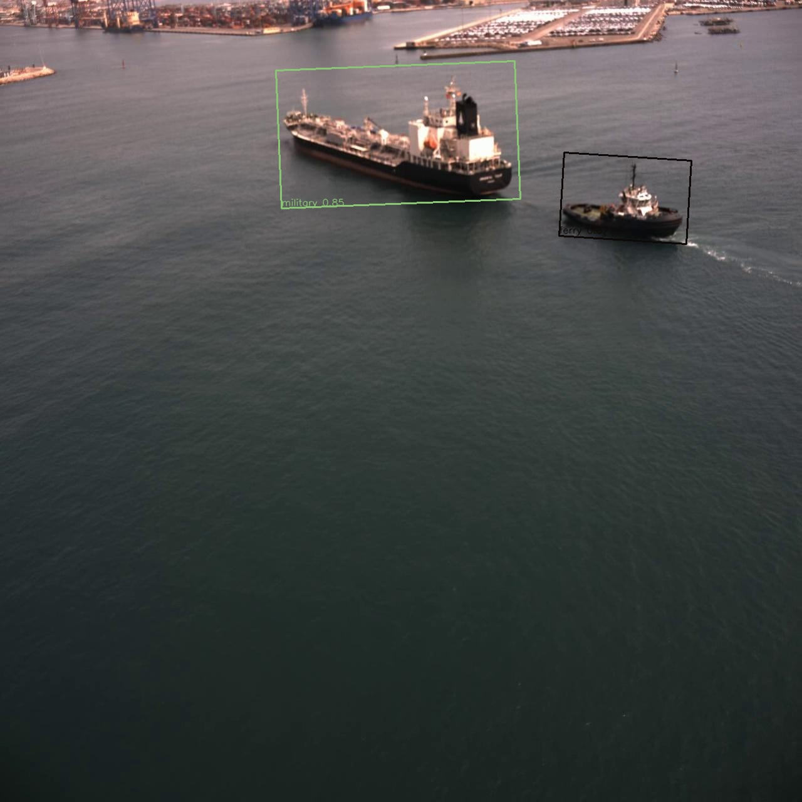
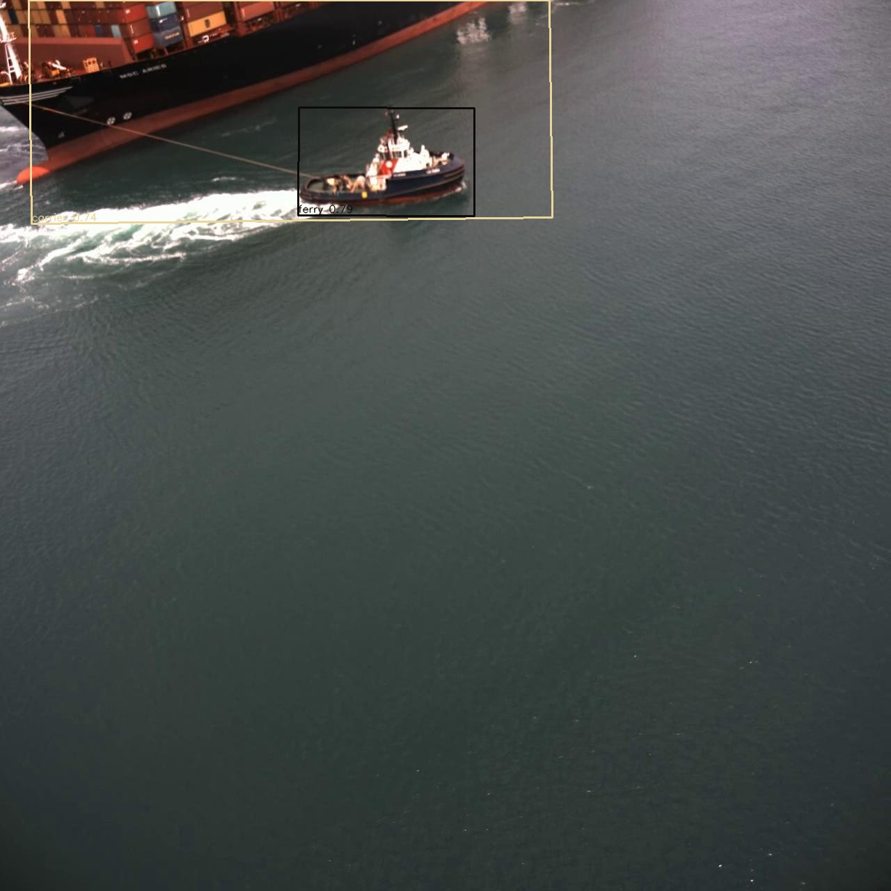

# Aerial Maritime Vessel Intelligence and Tracking

This repository contains the computer vision pipeline for aerial maritime surveillance. The project is focused on detecting vessels from drone or elevated camera footage, classifying them by type, and maintaining persistent tracks across video frames. 

**Project Stack:** YOLOv8-nano, TensorRT INT8, DeepSORT, Jetson Orin Nano,  MAVLink 
**Dataset:** VESSELimg (6,234 aerial images, 6 classes, OBB annotations)  

## Project Goals

The system is intended for maritime monitoring scenarios where a fixed-axis detector is not sufficient:

- vessels appear at arbitrary headings and aspect ratios
- drone footage contains camera motion, scale changes, and long-range targets

The result is a pipeline that can train a vessel detector, export it to TensorRT, run real-time inference on video, and associate detections into stable track identities.

## 1 System Overview

```
[Aerial Camera / Video Stream]
         ↓
[YOLOv8n-OBB TensorRT INT8 Engine]  ← runs on Jetson Orin Nano
         ↓
[DeepSORT Tracker]  ← assigns persistent IDs
         ↓
[Target Selection Logic]  ← picks primary vessel to track
         ↓
[Error Computation: pixel offset from frame center]
         ↓
[PID Controller]  ← pan + tilt channels
         ↓
[MAVLink Gimbal Protocol v2]  ← sends GIMBAL_DEVICE_SET_ATTITUDE
         ↓
[Gimbal Motors]  ← keeps vessel in frame center
```

---

## Part 2: Model Architecture and Training

### 2.1 YOLOv8-nano OBB — Architecture Rationale

`yolov8n-obb` is YOLOv8's nano variant adapted for Oriented Bounding Box detection. Key architectural changes vs. standard YOLOv8:

- **Detection head outputs 5+nc values per anchor:** `(x, y, w, h, θ, cls_0 ... cls_n)` where θ is the rotation angle
- **Rotated NMS:** suppresses overlapping OBBs using IoU computed over rotated polygons (more expensive than standard NMS — factor this into latency budget)
- **Loss function:** uses RotatedIoULoss on the regression branch, CIoU equivalent for OBB

**Why nano?** Three reasons:
1. Jetson Orin Nano has 8GB shared memory — nano fits with headroom for tracking
2. Target is real-time (≥15 FPS) — larger models can't hit this
3. mAP50-95 = 0.75 is achievable with nano given the relatively constrained 6-class problem

**Parameter count:** ~3.1M parameters for yolov8n-obb vs. ~11M for yolov8s-obb. On INT8 Jetson inference, this translates to roughly 2× faster throughput.

### 2.2 Training Configuration

```python
# Core
epochs: 200
imgsz: 640              # standard; try 1024 if GPU memory allows
batch: 16               # for 11GB+ VRAM; reduce to 8 for smaller GPUs
device: 0               # GPU index
# Optimizer
optimizer: AdamW
lr0: 0.001              # initial learning rate
lrf: 0.01               # final LR = lr0 * lrf
momentum: 0.937
weight_decay: 0.0005
warmup_epochs: 3
warmup_momentum: 0.8
```


## Part 3: ONNX Export and TensorRT INT8 Quantization

###  INT8 Calibration Engine

INT8 quantization maps 32-bit float activations → 8-bit integers. The key is finding the right *scale factor* for each layer's activation range. TensorRT does this via **entropy calibration** over your calibration dataset.

**Why INT8 over FP16?** On Jetson Orin Nano's DLA (Deep Learning Accelerator), INT8 is ~4× faster than FP16 and ~8× faster than FP32. The Orin Nano has 40 TOPS of INT8 throughput vs ~10 TOPS FP16.

## Part 4: DeepSORT Tracker Integration

### 4.1 DeepSORT Algorithm — How It Works

DeepSORT extends SORT (Simple Online and Realtime Tracking) by adding a deep appearance feature extractor to the Kalman Filter + Hungarian Algorithm pipeline.

```
Detection t     →    [Feature Extractor]    →  Appearance features
Detection t     →    [Bounding box]
                                              ↘
                                           [Hungarian Assignment]  ←  Kalman Predictions
                                              ↙
                                       Track updates
                                    (confirmed / tentative)
```

The Kalman Filter models each track's state as:
```
state = [x, y, a, h, ẋ, ẏ, ȧ, ḣ]
where: a = aspect ratio, h = height, dots = velocities
```

**For OBB, we need to extend this state to include rotation:**
```
state = [x, y, w, h, θ, ẋ, ẏ, ẇ, ḣ, θ̇]
```

## Part 5: Target Selection and Error Computation

Before PID control, you need to select which vessel to track (if multiple are detected) and compute the pixel error for the gimbal controller.
The PID controller converts pixel error into gimbal velocity or position commands.

```
Error (pixels)  →  [PID]  →  Rate command (deg/s)  →  [Gimbal]  →  Camera moves
     ↑                                                                     |
     └────────────────────── [New frame / new centroid] ──────────────────┘
```

**Tuning intuition:**
- **Kp (proportional):** Drives toward target. Too high → oscillation. Too low → sluggish.
- **Ki (integral):** Eliminates steady-state error (e.g., wind on gimbal). Too high → windup.
- **Kd (derivative):** Damps oscillation by responding to rate of change. Too high → noise amplified.

For a camera gimbal tracking a slow-moving maritime vessel, a PD controller (Ki=0) with low gains often suffices.
MAVLink (Micro Air Vehicle Link) is the lightweight binary communication protocol used in all major open-source autopilots (PX4, ArduPilot). It runs over UART, UDP, or USB.

**Connection topology:**
```
Jetson Orin Nano ──UART/USB──→ PX4/ArduPilot ──UAVCAN/PWM──→ Gimbal
      (companion)                (flight controller)           (motors)
```

**Outputs:**

 


| Metric | Target |
|---|---|---|
| P50 latency (detection) | < 20ms |
| P95 latency (detection) | < 30ms |
| End-to-end FPS (det + track) | ≥ 15 FPS |
| Board power (MAXN) | < 10W |
| Model size (engine) | ~3MB | 
| mAP50-95 (test set) | ≥ 0.75 | 

### File Execution Order

```bash

python src/data/download.py

python src/data/augment.py
python src/data/calibration_dataset.py

python src/model/train.py

python src/model/export.py

python src/model/trt_builder.py

python src/pipeline.py --engine models/trt/vessel_int8.engine --source 0
```